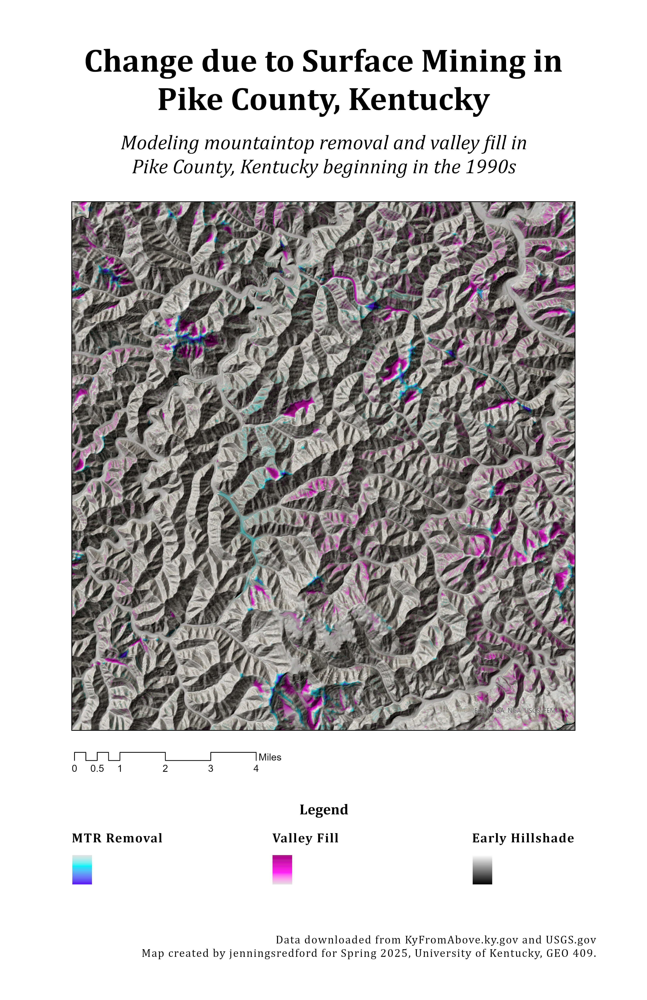

# Change due to Surface Mining in Pike County, Kentucky
 
 Modeling mountaintop removal and valley fill in Pike County, Kentucky beginning in the 1990s

Pike County, Kentucky is most widely known for their coal production, and mining operations have been steady in the area since the 1850s. When you think of coal mining, you typically think underground operations... but coal mining can and does alter the surface as well. Although mining in Pike County is and has not been strictly limited to coal, one cannot mention eastern Kentucky without mention of coal following shortly after. This map models visual surfaces changes due to mining operations in Pike County beginning in the 1990s. 

  
_Change due to Surface Mining in Pike County, Kentucky_

[Link to high-resolution version](MTR-fill-and-removal.pdf)

Map created by jenningsredford for Spring 2025, University of Kentucky, GEO 409. 
Data downloaded from KyFromAbove.ky.gov and USGS.gov